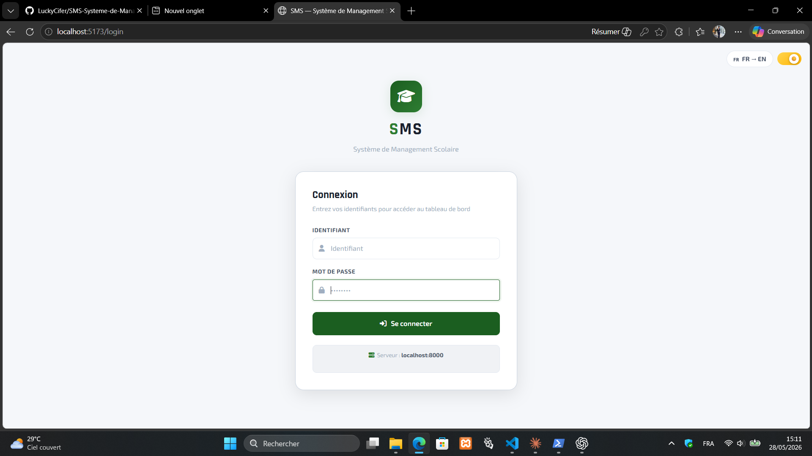
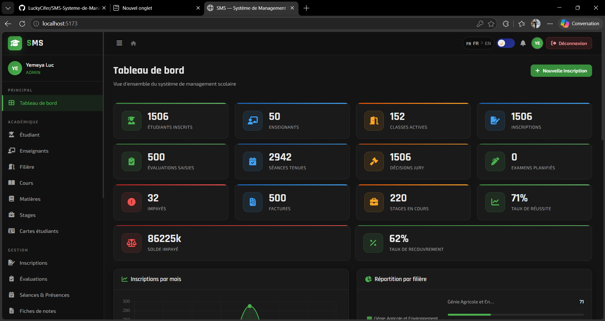
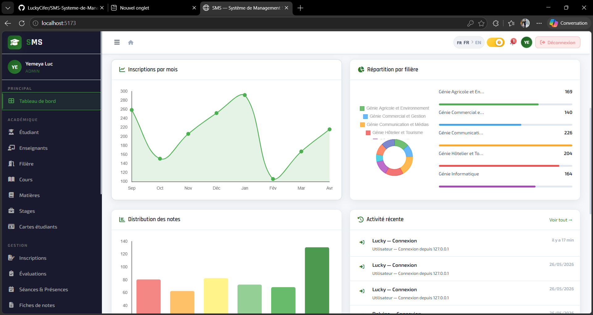
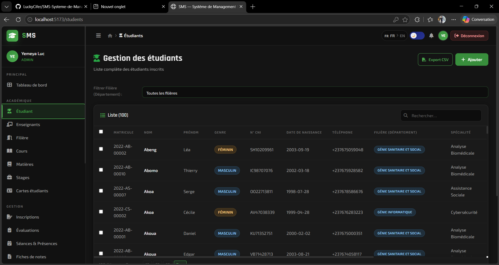
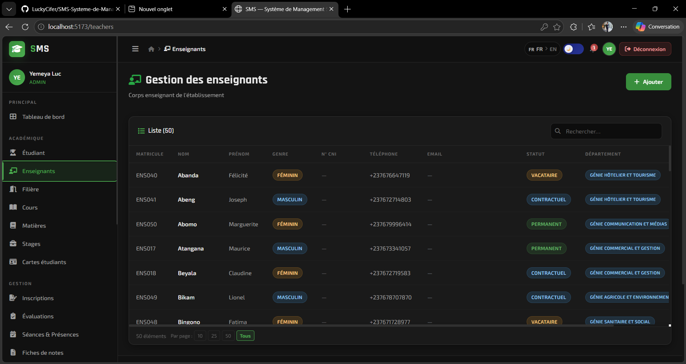
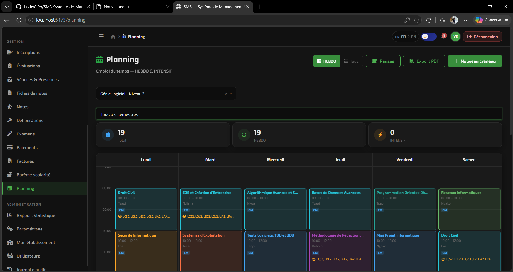
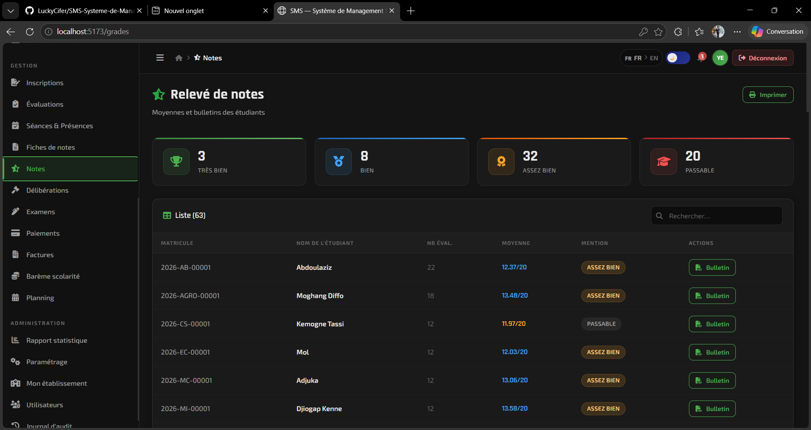

<div align="center">

# 📚 SMS — School Management System

**A full-stack school management application for academic institutions**

[](https://python.org)
[](https://djangoproject.com)
[](https://www.django-rest-framework.org/)
[](https://react.dev)
[](https://vitejs.dev)
[](https://mysql.com)
[](https://jwt.io)
[](LICENSE)

[Features](#-features) · [Tech Stack](#-tech-stack) · [Getting Started](#-getting-started) · [Architecture](#-architecture) · [API Documentation](#-api-documentation) · [Deployment](#-deployment) · [Author](#-author)

---

> *Developed as a capstone project for the ISA programme (Informatique et Systèmes d'Application), now deployed in a real academic institution.*

</div>

---

## 🖼️ Screenshots

### Login


### Dashboard



### Student & Teacher Management



### Timetable (Planning HEBDO)


### Grades & Academic Results


---

## ✨ Features

SMS covers the complete lifecycle of a school, from enrolment to graduation.

### 🏫 Academic Structure
- **Multi-institution** support with per-établissement data isolation
- Departments, specialities, classes, and academic years
- Configurable grade scales per institution type (Primary / Secondary / Higher Education)
- Bilingual interface **French 🇫🇷 / English 🇬🇧** with live toggle

### 👩‍🎓 Students & Staff
- Full student registry (personal data, guardians, region, CNI)
- Teacher management with qualifications and assignments
- Role-based access control (Admin, Secretary, Teacher, Student)

### 📋 Enrolment & Finance
- Student enrolment with automatic tuition fee calculation
- Multi-tranche payment tracking with invoicing
- Payment receipts and overdue balance alerts

### 📆 Academic Management
- **Weekly (HEBDO) & Intensive** timetable builder with PDF export
- Session & attendance tracking with digital sign-off
- Course catalogue with subject–class–teacher assignments

### 📊 Evaluations & Grades
- Configurable evaluation types (CC, DS, TP, Exam…)
- Grade sheets per class and per subject
- Automated average calculation and mention assignment
- Jury decisions (admitted / deferred / repeated year)

### 📄 Documents & Reports
- Student cards with QR code
- Exam convocations
- Internship management
- Statistics report (pass rates, gender breakdown, department enrolment)
- Complete audit log

---

## 🛠️ Tech Stack

| Layer | Technology |
|---|---|
| **Frontend** | React 18, React Router v6, Axios, Chart.js, Vite 7 |
| **Backend** | Django 5.2, Django REST Framework 3.17 |
| **Auth** | JWT via `djangorestframework-simplejwt` (24 h access / 30 d refresh) |
| **Database** | MySQL 9.5 |
| **Styling** | Custom CSS design system (dark / light theme) |
| **i18n** | Hand-rolled FR/EN translation layer |
| **CORS** | `django-cors-headers` |
| **Filters** | `django-filter` |

---

## 🚀 Getting Started

> 🐳 **With Docker** (no Python/Node/MySQL install needed): see [DOCKER.md](DOCKER.md).

### Prerequisites

| Tool | Version |
|---|---|
| Python | 3.11 + |
| Node.js | 18 + |
| MySQL | 9.x |
| npm | 9 + |

### 1 — Clone the repository

```bash
git clone https://github.com/LuckyCifer/SMS-Systeme-de-Management-Scolaire-.git
cd SMS-Systeme-de-Management-Scolaire-
```

### 2 — Database setup

Create the MySQL database and import the schema:

```sql
CREATE DATABASE sms CHARACTER SET utf8mb4 COLLATE utf8mb4_unicode_ci;
```

> Import the schema from `scripts/schema.sql` if provided, or run Django migrations (step 4).

### 3 — Backend setup

```bash
cd backend

# Create and activate a virtual environment
python -m venv venv
# Windows:
.\venv\Scripts\activate
# Linux / macOS:
source venv/bin/activate

# Install dependencies
pip install -r requirements.txt
```

Create the environment file:

```bash
# Copy the example and fill in your values
cp .env.example .env
```

`.env` variables:

```env
SECRET_KEY=your-secret-key-here
DEBUG=True
DB_NAME=sms
DB_USER=root
DB_PASSWORD=your_mysql_password
DB_HOST=127.0.0.1
DB_PORT=3306
```

### 4 — Run migrations and start Django

```bash
python manage.py migrate
python manage.py runserver
# API available at http://localhost:8000
```

### 5 — Frontend setup

```bash
cd ../frontend
npm install
npm run dev
# App available at http://localhost:5173
```

---

## 📁 Project Structure

```
SMS-Systeme-de-Management-Scolaire-/
├── backend/                    # Django application
│   ├── api/                    # Main app
│   │   ├── migrations/         # Database migrations
│   │   ├── management/         # Custom manage.py commands
│   │   ├── models.py           # 40+ Django models
│   │   ├── serializers.py      # DRF serializers
│   │   ├── views.py            # ViewSets (60+ endpoints)
│   │   ├── urls.py             # API router
│   │   ├── mixins.py           # EtablissementFilterMixin
│   │   ├── pagination.py       # Custom pagination
│   │   └── utils.py            # Helpers (audit log, IP)
│   ├── sms_backend/            # Django project config
│   │   ├── settings.py
│   │   └── urls.py
│   ├── requirements.txt
│   └── manage.py
│
├── frontend/                   # React + Vite application
│   ├── src/
│   │   ├── components/         # Reusable UI components
│   │   ├── context/            # React context (App, Notifications)
│   │   ├── hooks/              # Custom hooks (useApi, useEtablissement…)
│   │   ├── i18n/               # FR / EN translation files
│   │   ├── layouts/            # Layout, Navbar, Sidebar
│   │   ├── pages/              # One component per page (25+ pages)
│   │   ├── routes/             # Protected route configuration
│   │   ├── services/           # Axios instance + endpoint helpers
│   │   ├── styles/             # Global CSS design system
│   │   └── utils/              # Auth helpers, role guards, etabLabels
│   ├── package.json
│   └── vite.config.js
│
├── docs/
│   └── ARCHITECTURE.md         # Models, endpoints, auth flow
├── scripts/                    # SQL migration / seed scripts
├── .gitignore
└── README.md
```

---

## 📐 Architecture

See [docs/ARCHITECTURE.md](docs/ARCHITECTURE.md) for a detailed description of the data models, API endpoints, and JWT authentication flow.

---

## 📖 API Documentation

The API schema is generated automatically from the DRF ViewSets/serializers (`drf-spectacular`) — it stays in sync with the code, no hand-maintained doc to go stale.

| UI | URL |
|---|---|
| Swagger UI (interactive, try-it-out) | `/api/docs/` |
| ReDoc (read-only, cleaner for reference) | `/api/redoc/` |
| Raw OpenAPI 3 schema (YAML/JSON) | `/api/schema/` |

Locally, once the backend is running: [http://localhost:8000/api/docs/](http://localhost:8000/api/docs/).

For the narrative version (data model diagrams, auth flow, multi-institution isolation), see [docs/ARCHITECTURE.md](docs/ARCHITECTURE.md) instead — the two are complementary.

---

## 🚢 Deployment

### Backend (Django)

1. Provision a MySQL 8+ database and a server able to run Python 3.11 (a plain Linux VPS, or any PaaS that reads a `Procfile` — Render, Railway, and similar all work; one is included at `backend/Procfile`).
2. Copy `.env.example` to `.env` and set **production** values — at minimum:
   - `SECRET_KEY` — generate one: `python -c "from django.core.management.utils import get_random_secret_key; print(get_random_secret_key())"`
   - `DEBUG=False`
   - `ALLOWED_HOSTS` — your API domain(s)
   - `CORS_ALLOWED_ORIGINS` — your frontend domain(s)
   - `DB_*` — production database credentials
   - `EMAIL_*` — real SMTP credentials, if convocations/receipts should send actual emails (defaults to printing to the console otherwise)
3. Install dependencies, migrate, collect static files:
   ```bash
   pip install -r requirements.txt
   python manage.py migrate
   python manage.py collectstatic --noinput
   ```
4. Run with a production WSGI server — not `manage.py runserver`:
   ```bash
   # Linux
   gunicorn sms_backend.wsgi:application --bind 0.0.0.0:8000
   # Windows (gunicorn has no fork() support there)
   waitress-serve --port=8000 sms_backend.wsgi:application
   ```
5. Put a reverse proxy in front for TLS termination and to serve `static/`/`media/` directly:
   ```nginx
   server {
       listen 443 ssl;
       server_name api.sms.example.cm;

       location /static/ { alias /path/to/backend/staticfiles/; }
       location /media/  { alias /path/to/backend/media/; }

       location / {
           proxy_pass http://127.0.0.1:8000;
           proxy_set_header Host $host;
           proxy_set_header X-Forwarded-Proto $scheme;
       }
   }
   ```
   If the proxy terminates TLS, set `BEHIND_HTTPS_PROXY=True` in `.env` so Django trusts `X-Forwarded-Proto` — otherwise leave it unset.

### Frontend (React)

```bash
cd frontend
npm install
cp .env.example .env    # set VITE_API_URL to the backend's public URL first
npm run build            # outputs static files to dist/
```

`VITE_API_URL` is baked in at build time, not read at runtime — set it **before** running `npm run build`, not after. Serve `dist/` from the same reverse proxy (or any static host/CDN).

### Before going live

- [ ] `DEBUG=False`
- [ ] Real `SECRET_KEY` from the environment, not the dev fallback
- [ ] `ALLOWED_HOSTS` / `CORS_ALLOWED_ORIGINS` restricted to real domains
- [ ] HTTPS enforced (`SECURE_SSL_REDIRECT=True`, HSTS settings)
- [ ] Database credentials rotated from the dev defaults
- [ ] `python manage.py test` passes

---

## 👤 Author

**Luc** — *[LuckyCifer](https://github.com/LuckyCifer)*

Built with ❤️ as part of the ISA academic programme and deployed in production at a real Cameroonian institution.

---

## 📄 License

This project is licensed under the [MIT License](LICENSE).
